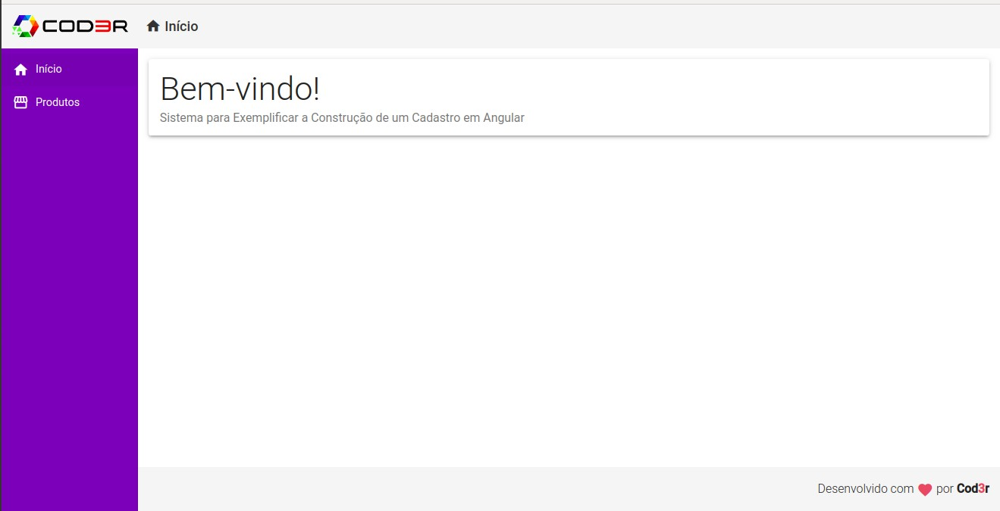
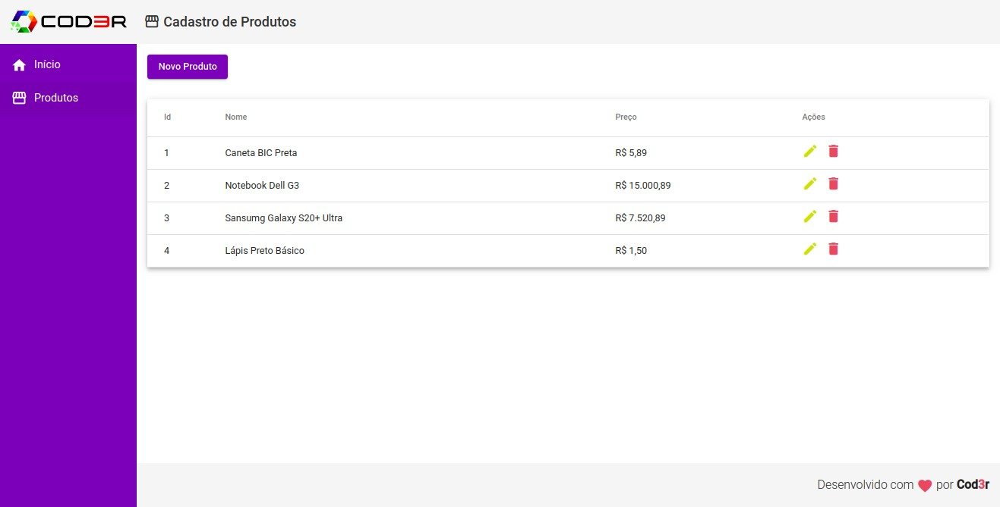
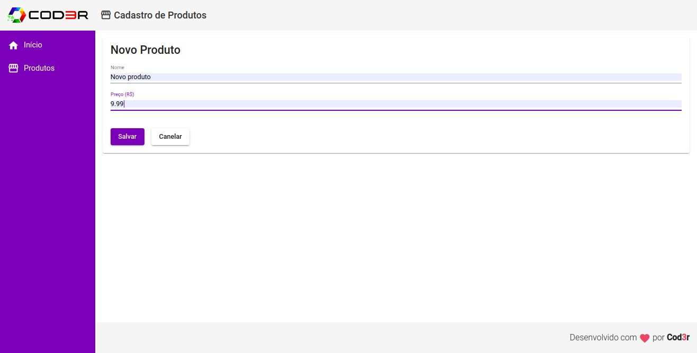
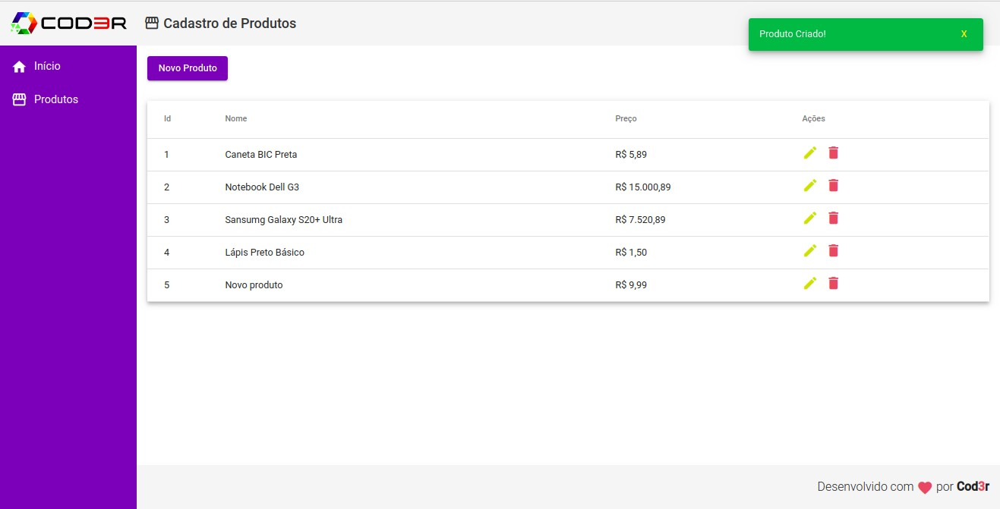
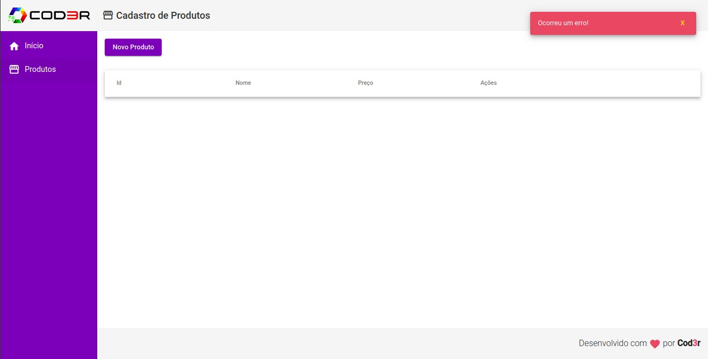

# ➤ Angular 9 - Essencial

CRUD completo de produtos desenvolvido como exemplo no treinamento de Angular 9 da Cod3r.

### ➤ Status do Projeto

  

### ➤ Certificado

[Ver](https://www.cod3r.com.br/certificates/wcmxvq2h4x)

### ➤ Imagens do Sistema

#### Home

#### Lista de Produtos

#### Novo Produto

#### Mensagem de Confirmação de Cadastro

#### Mensagem de Validação

### ➤ Instalação

#### Pré-Requisitos
Para executar este projeto é necessário instalar o [Git](https://git-scm.com/) e o [Node.js](https://nodejs.org/en/)

#### ➤ Rodar Localmente
Para rodar localmente primeiro abra o terminal do git e clone o projeto com:
` git clone https://github.com/leonardo-teles/angular-crud ` .

#### Back-end:
Acesse a pasta back-end e rode o comando `npm start` . O Json Server irá iniciar a aplicação. O recurso de produtos poderá ser testado no seguinte endereço: `http://localhost:3001/products`

#### Front-end:
Acesse a pasta front-end e rode o comando `npm install` para instalar as dependências necessárias.Execute o comando `npm start`. O projeto poderá ser testado no seguinte endereço: `http://localhost:4200`

### ➤ Tecnologias

#### Back-end
* Json Server 0.16.1

#### Front-end
* TypeScript 3.9.5
* Angular 10.0.2
